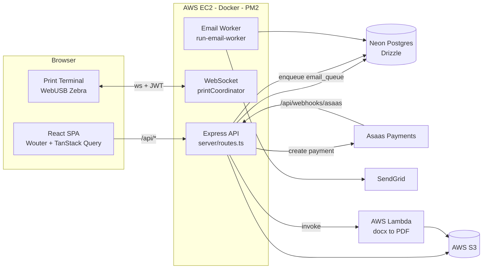

# Architecture Overview

One Node process serves the API and (in prod) the built SPA from `dist/`. A second PM2 process runs the email worker. See [[50-Infrastructure/Deployment]].

## Server layering
- `server/index.ts` — express setup, `trust proxy`, 50mb JSON limits, API request logging, error handler, vite dev middleware.
- `server/routes.ts` — **all 61 HTTP routes in a single ~3.4k-line file**. See [[20-Backend/API-Endpoints]].
- `server/storage.ts` — data-access layer wrapping Drizzle (`storage.*` methods); routes never touch `db` directly.
- `server/services/` — external integrations (Asaas, SendGrid, S3, Lambda, QR). See [[20-Backend/Services-Overview]].
- `server/middleware/` — `auth.ts` (`authenticateToken`, `requireEmailVerification`), `errorHandler.ts`.
- `server/workers/emailWorker.ts` — polls `email_queue`, sends via SendGrid, retries. See [[20-Backend/Workers-and-Middleware]].
- `server/print/printCoordinator.ts` — WebSocket coordinator for badge printing. See [[20-Backend/Print-Coordinator]].
- `server/utils/finalizeOrderPaidLikeWebhook.ts` — shared payment finalization used by webhook and manual status check. After `paid`, `sendPurchaseConfirmationEmail` sends a QR ticket (presencial) or the meeting URL (online), with optional `confirmation_email_html` injected. See [[20-Backend/Event-Modality]].

## Key patterns
- **DB-backed job queues** everywhere (`email_queue`, `mass_send_jobs`, `reminder_jobs`, `communicate_jobs`, `print_jobs`): status enum `pending|processing|completed|failed`, attempts counter. No Redis in practice.
- **Webhook-driven payment finalization**: Asaas webhook and `POST /api/orders/:id/check-status` both funnel into `finalizeOrderPaidLikeWebhook`.
- **Event modality**: `events.modality` (`presencial` default | `online`). Online skips QR, e-mails `meeting_url`, and shows meeting + optional WhatsApp on Meus Ingressos after confirmation (secret: stripped from public GET). [[20-Backend/Event-Modality]].
- **Zod at the edge**: drizzle-zod insert schemas validate request bodies.
- **Admin gating**: `authenticateToken` + in-handler `isAdmin` check (no dedicated admin middleware).
- **Placeholders in email templates**: `{nome}`, `{evento}`, `{data}`, `{link}` replaced per recipient.
