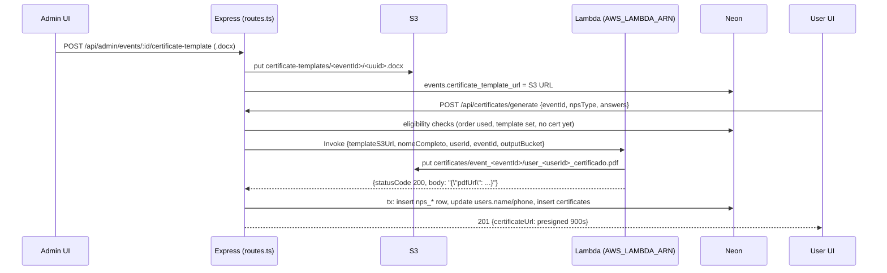

# Certificates (docx template → Lambda → PDF)

End-to-end reference for the attendee certificate feature. Everything below was proven live against production on 2026-09-04 with throwaway fixtures (see [[#Reusable test procedure]]); code fixes from that session are in commit `1678b8a` (not yet deployed at time of writing, see [[50-Infrastructure/Deployment]]).

Related: [[60-Decisions/ADR-004-lambda-certificates|ADR-004]] · [[50-Infrastructure/AWS-Services|AWS Services]] · [[20-Backend/API-Endpoints|API Endpoints]] · [[40-Database/Normalization-History|Normalization History]] · [[70-Operations/Operator-Guides|Operator guide "Como atualizar o template dos certificados"]]

## Flow



## Admin workflow and placeholder syntax

1. Admin opens `/admin/events/certificate-template` (`client/src/pages/CertificateTemplateAdminPage.tsx`), picks the event, uploads a `.docx`.
2. `POST /api/admin/events/:eventId/certificate-template` (`routes.ts` ~2135): `authenticateToken` + `req.user.isAdmin` check, multer field name **`file`**, accepts only `.docx` extension or the WordprocessingML MIME. Stores at `certificate-templates/<eventId>/<uuid>.docx` and writes the full S3 URL to `events.certificate_template_url`. Returns **201** `{event, certificateTemplateUrl}`.
3. Re-uploading writes a new uuid key; the old object is not deleted (harmless orphan).

**Placeholder**: the Lambda substitutes **both** `{{ nome }}` (docxtpl/Jinja2 style, what the real template in S3 uses) **and** `{nome}`. Proven with a template containing both lines: `pdftotext` on the generated PDF showed both filled with the test name. The admin hint was updated in `1678b8a` to show both. No other placeholder is known to be supported.

## Eligibility rules (`POST /api/certificates/generate`)

Checked in this order (`routes.ts` ~3401). Body is validated first by `generateCertificateBodySchema`, a Zod discriminated union on `npsType` (`cdpi_event` | `cdpi_apoiando`) with the matching answers schema.

| # | Condition | Failure response |
|---|---|---|
| 0 | Body matches one union branch | `400 {"message":"Dados inválidos","issues":…}` |
| 1 | No `certificates` row for (user, event) | `409 {"error":"Certificate already generated"}` |
| 2 | Event exists | `400 "Evento não encontrado"` |
| 3 | `events.nps_type == body.npsType` | `409 "Tipo de NPS do evento não corresponde…"` |
| 4 | `events.certificate_template_url` non-empty (trimmed) | `400 "Evento sem template de certificado"` |
| 5 | An `orders` row for user+event with `qr_code_used = true` | `400 "Você não está elegível para certificado neste evento"` |
| 6 | `AWS_S3_BUCKET_NAME` set | `500 "Configuração de armazenamento ausente"` |
| 7 | Phone in answers normalises to E.164 | `400 {message}` (was a bare 500 before `1678b8a`) |

Note on 3: the 409 "Tipo de NPS" branch only fires when the body *matches a schema* but the event's `nps_type` differs. Sending the wrong `npsType` with the wrong answers shape fails earlier at step 0 with 400.

`GET /api/users/me/certificates` uses the same join (orders with `qr_code_used=true` × events with template) to list which events the user can generate for, left-joined to `certificates` for the existing URL. Paginated, 15 per page.

## Lambda contract and cold start

`server/services/certificateLambdaService.ts`, `InvocationType: RequestResponse`.

**Request payload**
```json
{ "templateS3Url": "https://<bucket>.s3.sa-east-1.amazonaws.com/certificate-templates/<eventId>/<uuid>.docx",
  "nomeCompleto": "Nome Do Participante",
  "userId": "<uuid>", "eventId": "<uuid>",
  "outputBucket": "cdpi-pass-qr-codes" }
```

**Response** (API Gateway/Python shape): `{"statusCode": 200, "body": "{\"pdfUrl\": \"https://…/certificates/event_<eventId>/user_<userId>_certificado.pdf\"}"}`. The service also tolerates `body` as an object or a top-level `pdfUrl`. `statusCode != 200` or missing `pdfUrl` throws.

**Cold start**: the first invoke after idle fails with `CodeArtifactUserPendingException` (message "Lambda is initializing"). The service retries every **5 s** for up to **45 s** total. Observed live: 4 retries × 5 s, **37.1 s** wall time cold; **7.8 s** warm. The frontend must tolerate ~40 s; do not lower the client timeout below that.

`nomeCompleto` comes from the NPS answers (`payload.row.name`), not from `users.name`, and the same transaction updates `users.name`/`users.phone` with the answers.

## S3 layout and presigned serving

Bucket `cdpi-pass-qr-codes` (`AWS_S3_BUCKET_NAME`), see [[50-Infrastructure/AWS-Services]].

| Key | Written by | Access |
|---|---|---|
| `certificate-templates/<eventId>/<uuid>.docx` | API upload route | private |
| `certificates/event_<eventId>/user_<userId>_certificado.pdf` | Lambda | private |

Stored `certificates.certificate_url` is the raw S3 URL. Both `/api/certificates/generate` and `/api/users/me/certificates` sign it per request via `server/utils/presignedUrl.ts` (`toPresignedUrl`, **900 s** TTL, returns `null` on failure so one bad row does not break the page). Unsigned `GET` on a certificate PDF returns **403** (verified). The client always refetches from the authenticated API, so the short TTL is invisible to users.

## Failure modes

| HTTP | Body | Cause | Where |
|---|---|---|---|
| 201 | `{certificateUrl}` | Success (presigned) | generate |
| 201 | `{event, certificateTemplateUrl}` | Template uploaded | template upload |
| 400 | `Dados inválidos` + `issues` | Zod union mismatch (incl. wrong `npsType` for the answers shape) | generate |
| 400 | `Evento sem template de certificado` | `certificate_template_url` empty | generate |
| 400 | `Você não está elegível…` | No used ticket for this event | generate |
| 400 | phone message | Invalid phone (`normalizePhoneE164` threw) | generate, fixed in `1678b8a` |
| 400 | `Apenas arquivos .docx…` / `Envie um arquivo .docx` | Bad upload | template upload |
| 409 | `{"error":"Certificate already generated"}` | Existing row, or unique violation `23505` in the race | generate |
| 409 | `Tipo de NPS…` | Body valid but `events.nps_type` differs | generate |
| 500 | `Configuração de armazenamento ausente` | `AWS_S3_BUCKET_NAME` unset | generate |
| 500 | `PDF generation failed` + detail mentioning `AWS_LAMBDA_ARN` | Lambda ARN not configured | generate |
| 500 | `Certificado gerado mas falhou ao salvar respostas…` | DB transaction failed **after** the PDF exists (the `nps_responses` incident below). PDF is orphaned in S3; user can retry once the DB is fixed because no `certificates` row was written | generate |
| 502 | `PDF generation failed` + Lambda message | Any other Lambda error (timeout after 45 s, template not found, bad docx) | generate |
| 503 | `PDF generation failed` + IAM hint | `AccessDeniedException` / `not authorized to perform: lambda:InvokeFunction` | generate |

## Incident: `certificates.nps_responses` NOT NULL (2026-09-04)

- **Symptom**: every `POST /api/certificates/generate` returned 500 "Certificado gerado mas falhou ao salvar respostas", *after* the Lambda had produced the PDF.
- **Root cause**: `sql/cleanup_legacy_nps_responses.sql` (drops the legacy jsonb column) was written when NPS moved to typed tables but was **never run on Neon**. The column still existed with `NOT NULL` and no default, and the new code no longer writes it. The feature had 0 rows and 0 templated events in prod, so nobody hit it until the live test.
- **Fix**: ran the file on Neon 2026-09-04 (`ALTER TABLE certificates DROP COLUMN IF EXISTS nps_responses;`, table was empty). Recorded in [[40-Database/Normalization-History]].
- **Lesson**: `sql/` files can sit unapplied with no tracking. Tracked as a backlog item in [[70-Operations/Security-Backlog]]; process in [[40-Database/Migration-Workflow]].

## Reusable test procedure

Runs against the live stack from the EC2 box (or a tunnel to `127.0.0.1:5003`) without touching real users. Used on 2026-09-04; the cleanup step is mandatory.

1. **Template**: `~/.jcode/scratch/certtest/make_test_template.py <out.docx>` builds a stdlib-only `.docx` containing both `{{ nome }}` and `{nome}` lines (so one run shows which style the Lambda substitutes).
2. **Fixtures** (node script from `~/CDPI-Pass/frontend`, `dotenv` + `pg`, parameterized inserts only): an **inactive** event named `ZZ_VERIFY_DELETE_ME_<ts>` with the target `nps_type`, a temp admin user, a temp attendee user, and a `paid` order for attendee+event with `qr_code_used = true`.
3. **JWTs**: sign `{id, email, isAdmin}` with `jsonwebtoken` and `JWT_SECRET` from `.env` (same claims `authenticateToken` expects).
4. **Upload**: `curl -F file=@out.docx -H "Authorization: Bearer $ADMIN_JWT" http://127.0.0.1:5003/api/admin/events/$EVENT/certificate-template` → expect 201.
5. **Generate**: `curl -X POST -H "Authorization: Bearer $USER_JWT" -H 'Content-Type: application/json' -d '{"eventId":…,"npsType":…,"answers":{…}}' http://127.0.0.1:5003/api/certificates/generate` → expect 201 (allow ~40 s for cold start). Then repeat to confirm 409, and try wrong `npsType` (400), invalid phone (400), unsigned S3 GET (403).
6. **Verify PDF**: download the presigned URL, `pdftotext out.pdf - | grep -i <name>`.
7. **Cleanup**: delete rows in `certificates`, `nps_cdpi_*_responses`, `orders`, the two `users`, the `events` row; `aws s3 rm` both objects (`certificate-templates/<eventId>/` and `certificates/event_<eventId>/`). Re-verify baseline counts (2026-09-04: 543 users / 16 admins / 8 events / 578 orders / 0 certificates).

Never run this against an active event or a real user, and never leave the fixture event active (it would appear on the public home page).
