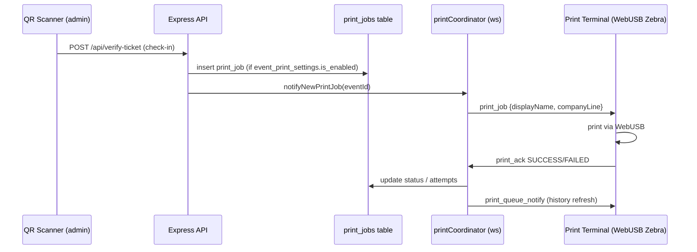

# Print Coordinator (WebSocket badge printing)

`server/print/printCoordinator.ts` — coordinates Zebra badge printing between the server and browser-based print terminals (`/admin/print-terminal`, WebUSB).

## Flow

## Protocol
- Terminal connects with `?token=<JWT>&eventId=<id>` query params; token verified with `JWT_SECRET`.
- Client state per socket: `ready`, `busy`, `currentJobId`.
- Incoming messages: `printer_ready`, `printer_offline`, `print_ack {job_id, status, error_code?, message?}`.
- Jobs are **claimed** (locked by `locked_by_socket_id`) so multiple terminals don't double-print.
- Failure: attempts incremented, max 3; `last_error_code`/`last_error_message` stored.
- Guarantee: `print_job` message is dispatched **before** `print_queue_notify` so the browser sees the job before the history refresh ping.

## Related tables
`print_jobs`, `event_print_settings` — see [[40-Database/Schema-Overview]].
