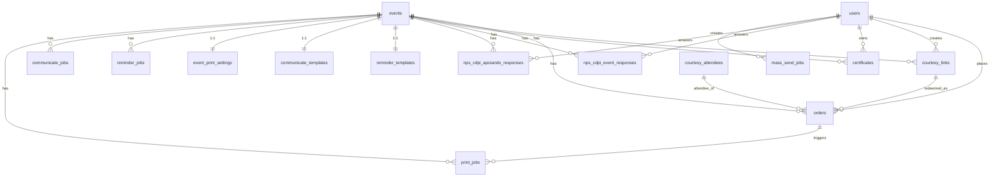

# Database Schema Overview

Source of truth: `frontend/shared/schema.ts` (Drizzle). 16 tables. Hosted on Neon Postgres ([[50-Infrastructure/Neon-Database]]). **All changes via manual SQL** — [[40-Database/Migration-Workflow]].

## ER Diagram

## Tables

### Core
| Table | PK | Notes |
|---|---|---|
| `users` | uuid | email + cpf unique, `is_admin`, email verification code + expiry, `partner_company` |
| `events` | uuid | price decimal(10,2), `nps_type` enum (`cdpi_event`\|`cdpi_apoiando`), `modality` enum (`presencial`\|`online`, default presencial, CHECK `events_modality_chk`), `meeting_url` (secret on public APIs; required when online via CHECK `events_online_meeting_url_chk`; confirmed attendees also see it on Meus Ingressos), `whatsapp_group_url` (optional, online only, secret on public APIs), `confirmation_email_html` (optional TipTap inject into confirmation e-mail; public APIs omit it), certificate/courtesy templates + `courtesy_email_subject` on the row. See [[20-Backend/Event-Modality]] |
| `orders` | uuid | **central table**: `status` `pending\|paid\|cancelled`, `payment_method` (incl. `courtesy`), `asaas_payment_id`, QR fields (`qr_code_data`, `qr_code_s3_url`, `qr_code_used` — filled only for presencial), multi-use (`max_uses`, `amnt_used`), FKs → users, events, courtesy_links, courtesy_attendees |
| `courtesy_links` | uuid | unique `code`, `ticket_count`/`used_count`, `override_price`, `created_by` → users |
| `courtesy_attendees` | uuid | redemption form data (name, cpf, phone E.164, occupation, partner_company); denormalized `event_title` |
| `certificates` | serial | unique (user_id, event_id); `certificate_url` (S3 PDF) |

### NPS
| Table | Notes |
|---|---|
| `nps_cdpi_event_responses` | Evento CDPI survey (workshop feeling, temas Sim/Não, didática, highlight, career value, attend-again, support + Outro follow-up, optional recado, `privacy_consent`). Unique (user, event) |
| `nps_cdpi_apoiando_responses` | Evento de Terceiros survey (`overall_score` 0–10, future topics, organization + Outro follow-up, optional feedback, `privacy_consent`). Unique (user, event) |

### Job queues (all: status `pending|processing|completed|failed`)
| Table | Notes |
|---|---|
| `email_queue` | to/subject/html/text/attachments(JSON), attempts, `processed_at`. Status: `pending|sent|failed` |
| `mass_send_jobs` | courtesy CSV mass send: `csv_data` text, `attachment_data` JSON string |
| `reminder_jobs` | per event; consumed by email worker |
| `communicate_jobs` | per event + `recipient_mode` enum |
| `print_jobs` | badge printing: `display_name`, `company_line`, `locked_by_socket_id`, attempts (max 3), error fields |

### Per-event 1:1 config (PK = event_id)
| Table | Notes |
|---|---|
| `reminder_templates` | body + subject, placeholders `{nome} {evento} {data} {link}` |
| `communicate_templates` | body + subject, placeholders `{nome} {evento} {data}` |
| `event_print_settings` | `is_enabled` toggle for auto badge print on check-in |

## Conventions
- PKs: `gen_random_uuid()` varchar (except `certificates` serial).
- Newer tables use `TIMESTAMPTZ` (`withTimezone: true`); older core tables use plain `timestamp`.
- Zod insert schemas via drizzle-zod, PT-BR validation messages (CPF format `000.000.000-00`, phone 8-15 digits E.164 without `+`).
- Relations declared in schema.ts; `storage.ts` is the only DB access layer.
