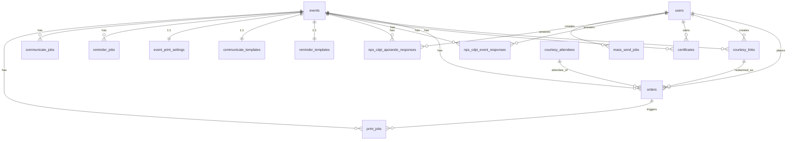

# Database Schema Overview

Source of truth: `frontend/shared/schema.ts` (Drizzle). 16 tables. Hosted on Neon Postgres ([[50-Infrastructure/Neon-Database]]). Every DB object (checks, indexes, FKs, defaults) is declared there; changes go through `drizzle-kit push`. See [[40-Database/Migration-Workflow]].

## ER Diagram

```mermaid
erDiagram
  users ||--o{ orders : places
  users ||--o{ courtesy_links : creates
  users ||--o{ certificates : owns
  users ||--o{ nps_cdpi_event_responses : answers
  users ||--o{ nps_cdpi_apoiando_responses : answers
  events ||--o{ orders : has
  events ||--o{ courtesy_links : has
  events ||--o{ certificates : has
  events ||--o{ nps_cdpi_event_responses : has
  events ||--o{ nps_cdpi_apoiando_responses : has
  events ||--|| reminder_templates : "1:1"
  events ||--|| communicate_templates : "1:1"
  events ||--|| event_print_settings : "1:1"
  events ||--o{ reminder_jobs : has
  events ||--o{ communicate_jobs : has
  events ||--o{ print_jobs : has
  orders ||--o{ print_jobs : triggers
  courtesy_links ||--o{ orders : redeemed_as
  courtesy_attendees ||--o{ orders : attendee_of
  users ||--o{ mass_send_jobs : creates
```

## Tables

### Core
| Table | PK | Notes |
|---|---|---|
| `users` | uuid | email unique, plus unique index `users_email_lower_unique` on `lower(email)` so case variants cannot be a second account. Account emails are stored trimmed and lowercase. `cpf` is unique and nullable: null only when `is_foreigner` is true, in which case `foreign_document` (varchar(32), unique where not null) holds the passport. Check `users_identity_document_chk` (loosened by ADR-016, 2026-10-08): a Brazilian account (`is_foreigner=false`) has no passport and **may have no CPF yet**; a foreign account has a passport and no CPF. `birth_date` and `address` are nullable (profile-only / asked by in-person inscriptions). `is_admin`, email verification code + expiry, `occupation`, `partner_company`, and `area_of_activity` (each `varchar(255)` NOT NULL, default `'Nao aplicavel'`; required on register, 2–255 chars). Courtesy redeem still stores occupation and company on `courtesy_attendees`, not these user columns |
| `events` | uuid | price decimal(10,2), `nps_type` enum (`cdpi_event`\|`cdpi_apoiando`), `modality` enum (`presencial`\|`online`, default presencial, CHECK `events_modality_chk`), `meeting_url` (secret on public APIs; required when online via CHECK `events_online_meeting_url_chk`; confirmed attendees also see it on Meus Ingressos), `meeting_password` (varchar(100), nullable, optional, online only, no CHECK tying it to modality; secret on public APIs; confirmation e-mail and confirmed Meus Ingressos; NULL when presencial or blank), `whatsapp_group_url` (optional, online only, secret on public APIs; confirmed attendees see it on Meus Ingressos), `confirmation_email_html` (optional TipTap inject into confirmation e-mail; public APIs omit it), certificate/courtesy templates + `courtesy_email_subject` on the row, optional `courtesy_limit` (integer, NULL = no cap; CHECK `events_courtesy_limit_chk` requires NULL or >= 1). See [[20-Backend/Event-Modality]] `registration_form` jsonb NOT NULL default `'[]'`: creator-defined questions (ADR-016); `interest_areas` deprecated, copied into it by the backfill |
| `orders` | uuid | **central table**: `status` `pending\|paid\|cancelled`, `payment_method` (incl. `courtesy`), `asaas_payment_id`, QR fields (`qr_code_data`, `qr_code_s3_url`, `qr_code_used` — filled only for presencial), multi-use (`max_uses`, `amnt_used`), FKs → users, events, courtesy_links, courtesy_attendees. `cpf` and `foreign_document` are nullable snapshots; check `orders_identity_document_chk` (ADR-016) forbids both and allows neither (online orders). `registration_answers` jsonb NOT NULL default `'[]'`: snapshot `{fieldId,label,value}[]` of the event form. `interest_area` is deprecated (read-only) |
| `courtesy_links` | uuid | unique `code`, `ticket_count`/`used_count`, `override_price`, `created_by` → users |
| `courtesy_attendees` | uuid | redemption form data (name, cpf or `foreign_document` when `is_foreigner`, phone E.164, occupation, partner_company). Check `courtesy_attendees_identity_document_chk` loosened like `users` (online courtesy needs no CPF); `birth_date` and `address` nullable (ADR-016). These columns are the redeem form, not `users.occupation` / `users.partner_company`. Denormalized `event_title` |
| `certificates` | serial | unique (user_id, event_id); `certificate_url` (S3 PDF) |

### NPS
| Table | Notes |
|---|---|
| `nps_cdpi_event_responses` | Evento CDPI survey (workshop feeling, temas Sim/Não, didática, highlight, career value, attend-again, support + Outro follow-up, optional recado, `privacy_consent`). Unique (user, event) |
| `nps_cdpi_apoiando_responses` | Evento de Terceiros survey (`overall_score` 0–10, future topics, organization + Outro follow-up, optional feedback, `privacy_consent`). Unique (user, event) |

### Job queues (all: status `pending|processing|completed|failed`)
| Table | Notes |
|---|---|
| `email_queue` | to/subject/html/text/attachments(JSON), attempts, `processed_at`. Status: `pending|sent|failed` |
| `mass_send_jobs` | courtesy CSV mass send: `csv_data` text, `attachment_data` JSON string |
| `reminder_jobs` | per event; consumed by email worker |
| `communicate_jobs` | per event + `recipient_mode` enum |
| `print_jobs` | badge printing: `display_name`, `company_line`, `locked_by_socket_id`, attempts (max 3), error fields |

### Per-event 1:1 config (PK = event_id)
| Table | Notes |
|---|---|
| `reminder_templates` | body + subject, placeholders `{nome} {evento} {data} {link}` |
| `communicate_templates` | body + subject, placeholders `{nome} {evento} {data}` |
| `event_print_settings` | `is_enabled` toggle for auto badge print on check-in |

## Conventions
- PKs: `gen_random_uuid()` varchar (except `certificates` serial).
- Newer tables use `TIMESTAMPTZ` (`withTimezone: true`); older core tables use plain `timestamp`.
- Zod insert schemas via drizzle-zod, PT-BR validation messages (CPF format `000.000.000-00`, phone 8-15 digits E.164 without `+`).
- Relations declared in schema.ts; `storage.ts` is the only DB access layer.
