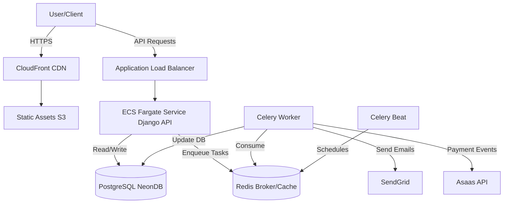

# CDPI Pass — Enterprise Event Management Platform

<div align="center">

A cloud-native, asynchronous ticketing platform engineered for **high-volume pharmaceutical events**.

[Report Bug](https://github.com/Cau393/CDPI-Pass/issues) · [Request Feature](https://github.com/Cau393/CDPI-Pass/issues/new)

</div>

---

## Table of Contents

- [Overview](#overview)
- [Key Engineering Highlights](#key-engineering-highlights)
- [Tech Stack](#tech-stack)
- [System Architecture](#system-architecture)
- [Getting Started](#getting-started)
  - [Prerequisites](#prerequisites)
  - [Installation](#installation)
  - [Environment Variables](#environment-variables)
  - [Development Workflow](#development-workflow)
- [Running Tests](#running-tests)
- [CI / CD](#ci--cd)
- [Security](#security)
- [Operational Notes](#operational-notes)
  - [Local debugging tips](#local-debugging-tips)
  - [Scaling & cost control](#scaling--cost-control)
- [Troubleshooting](#troubleshooting)
- [Contact](#contact)

---

## 🚀 Overview

**CDPI Pass** is a production-grade event management ecosystem that handles full ticketing lifecycle for large, regulated events. It’s designed for resiliency during traffic spikes (ticket drops, payment storms) using an asynchronous, event-driven architecture.

Goals:
- Maintain <100–200ms API latency for ticket endpoints under normal load
- Offload heavy work (PDF generation, email, reconciliation) to background workers
- Integrate securely with local payment providers (Asaas) and enterprise email (SendGrid)
- Deploy in a cloud-native fashion (ECS/Fargate, CloudFront, S3)

---

## 🎯 Key Engineering Highlights

### ⚡ Asynchronous Architecture
- **Redis** as broker/cache
- **Celery** for background tasks:
  - PNG ticket generation
  - Email delivery (SendGrid)
  - Payment reconciliation & webhook handling
- **Celery Beat** for scheduled maintenance tasks (expire reservations, data sanity checks)

### 💳 Payment Resilience
- Full Asaas integration: PIX, Boleto, Credit Card
- Webhook verification with signature validation
- Reconciliation tasks run to ensure financial consistency

### ☁️ Cloud-Native DevOps
- Multi-stage Docker builds (security & size optimized)
- AWS ECS (Fargate) services for API and workers
- GitHub Actions using OIDC to avoid long-lived AWS credentials
- Blue/Green / rolling deployment strategies for zero downtime
- Frontend served via S3 + CloudFront

---

## 🧰 Tech Stack

| Domain | Technologies |
|---|---|
| Frontend | React 18, TypeScript, Vite, TanStack Query, Tailwind CSS, Shadcn/UI |
| Backend | Python 3.13, Django REST Framework, Drizzle ORM (schema reference) |
| DB | PostgreSQL (Neon/managed), Redis (broker & cache) |
| Async | Celery, Celery Beat |
| Infra | Docker, AWS ECS (Fargate), AWS ECR, S3, CloudFront |
| Services | SendGrid (email), Asaas (payments), GitHub Actions (CI/CD) |

---

## 🏗️ System Architecture



## 💻 Getting Started

### Prerequisites

- Docker & Docker Compose
- Node.js v20+
- Python 3.13 for running backend tasks locally without containers

### Installation

```bash
# Clone the repository
git clone https://github.com/Cau393/CDPI-Pass.git
cd CDPI-Pass
```

### Environment Variables

Keep secrets out of git. Use `.env` files or a secrets manager (AWS Secrets Manager). Typical variables used (add to `.env.example`):

#### Backend (`backend/.env`)

```env
# ---- DEVELOPING AND TESTING SETTINGS ----
DATABASE_URL=DBURL

ALLOWED_HOSTS=localhost,127.0.0.1

# Django Config
DEBUG=PLACEHOLDER
SECRET_KEY=PLACEHOLDER

# Email (SendGrid)
SENDGRID_API_KEY=PLACEHOLDER
DEFAULT_FROM_EMAIL=PLACEHOLDER

# Celery Configuration
CELERY_BROKER_URL=redis://redis:6379/0
CELERY_RESULT_BACKEND=redis://redis:6379/0

# BaseURL
BASE_URL=http://localhost:5173

# AWS S3 Configuration
AWS_ACCESS_KEY_ID=PLACEHOLDER
AWS_SECRET_ACCESS_KEY=PLACEHOLDER
AWS_REGION=PLACEHOLDER
AWS_S3_BUCKET_NAME=PLACEHOLDER

# --- Payment Gateway (Asaas) ---
ASAAS_API_KEY=PLACEHOLDER
ASAAS_API_URL=https://api.asaas.com/v3
ASAAS_WEBHOOK_TOKEN="PLACEHOLDER"
```

### Start Everything Locally (Docker Compose)

```bash
docker-compose up --build
```

**Services:**
- **API:** http://localhost:8000
- **Frontend:** http://localhost:5173
- **Redis:** localhost:6379
- **DB:** (Using external)

### Useful Local Commands

```bash
# Backend shell
docker-compose exec backend bash

# Run backend migrations
docker-compose exec backend python manage.py migrate

# Create superuser
docker-compose exec backend python manage.py createsuperuser

# Launch a celery worker (if not using compose-managed worker)
docker-compose exec worker celery -A backend_app worker --loglevel=info
```

## 🧪 Running Tests

### Backend

```bash
docker-compose exec backend pytest -q
```

### Frontend

```bash
cd frontend
npm ci
npm run test
```

> **Tip:** Add test coverage reporting to CI for credibility: `pytest --cov=.` and upload reports to coverage services.

## 🔄 CI/CD

### High Level (GitHub Actions)

#### CI (PRs):
- **Lint:** Black (Python), isort, Flake8/Pylint
- **ESLint** + TypeScript type-check
- Unit tests & lightweight integration tests
- Dependency vulnerability scan

#### CD (merge → main):
- Build multi-arch Docker images
- Push to AWS ECR
- Update ECS task definitions (application + worker)
- Invalidate CloudFront & sync S3 for frontend

> **Security:** Use OIDC in Actions to assume fine-grained IAM roles; avoid long-lived credentials.

## 🛡️ Security

- JWT with rotation and refresh token policies
- Webhook signature verification for Asaas
- Least-privilege IAM roles for ECS tasks
- Rate limiting & monitoring at ALB/API level
- Secrets stored in Parameter Store or Secrets Manager (not in repo)

## 📋 Operational Notes

### Scaling & Cost Control

- **ECS Fargate:** Scale via service autoscaling (target CPU/RPS)
- Move long-running analytic jobs to separate batch cluster
- Pause dev worker services in non-active branches to save cost

## 🔧 Troubleshooting

### API returning 502 from ALB
Check ECS task health, container logs, and target group health checks.

### Celery tasks failing silently
- Check worker logs
- Confirm broker connection: `redis-cli -h <host> ping`
- Verify result backend connectivity

### Webhook events not received
- Confirm public endpoint is reachable (ngrok for local dev)
- Verify webhook signature secret matches stored secret

**If you get stuck:** Open an issue with logs and a short reproduction.

## 📞 Contact

**Developed by Caue Casonato**

- GitHub: [@Cau393](https://github.com/Cau393)
- LinkedIn: [Caue Casonato](https://www.linkedin.com/in/cauê-casonato/)
- Portfolio: [My Website](https://cauecasonatoportifolio.dev)

---

<div align="center">
  Made with ❤️ by Caue Casonato
</div>